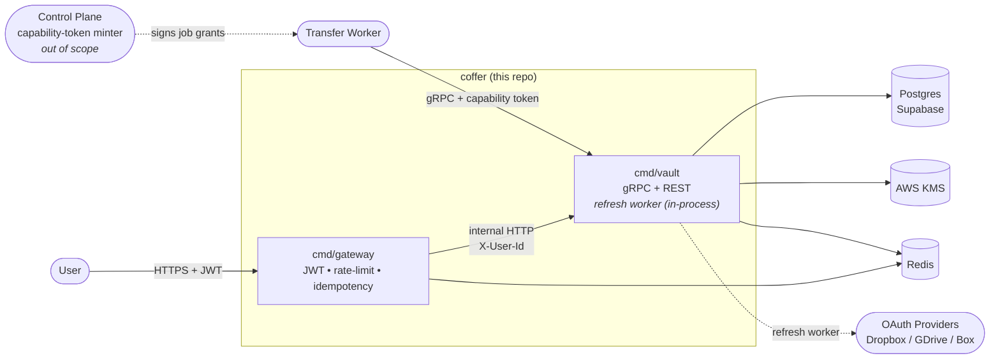
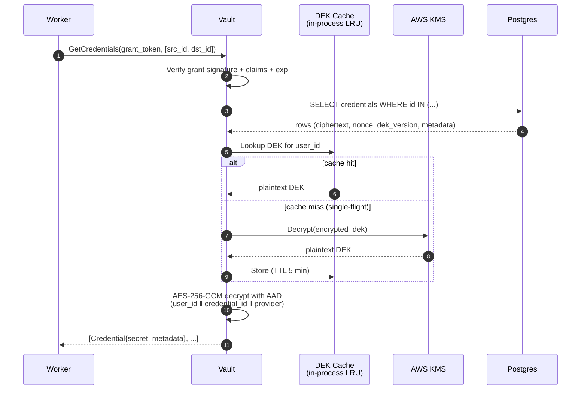
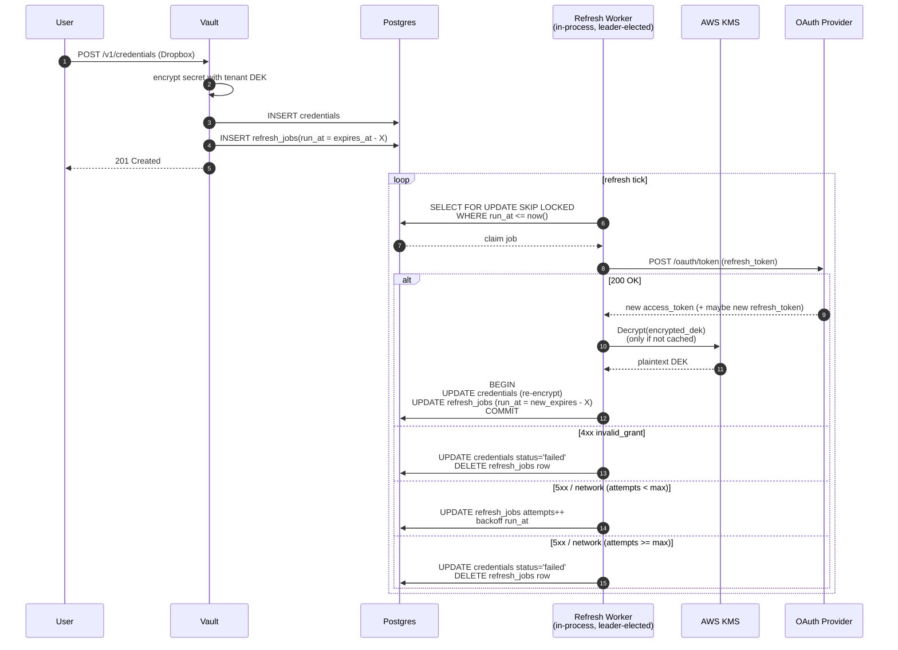
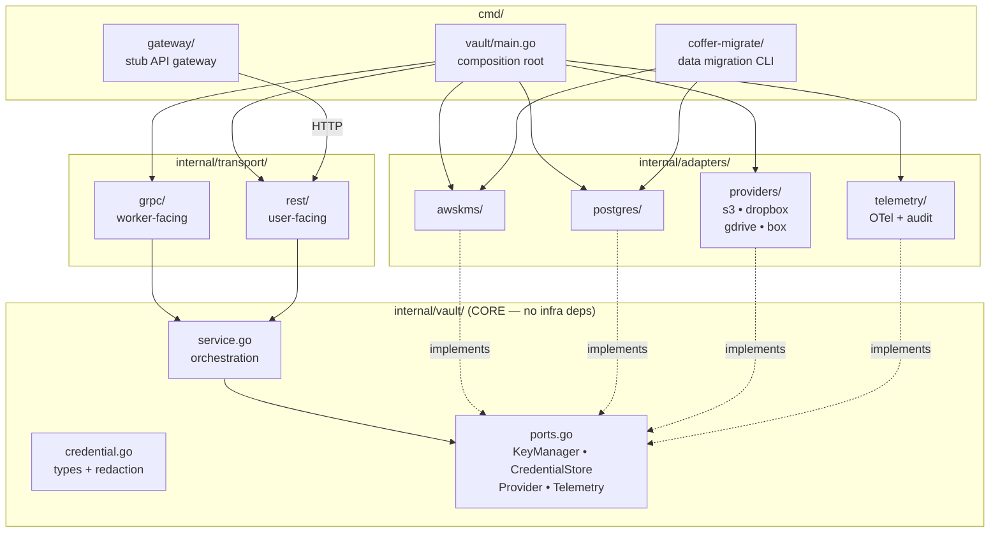

# coffer

Credentials vault microservice

A Go/gRPC service that stores customer credentials for external storage providers (S3, Dropbox, Google Drive, Box) and delivers them to transfer workers at transfer time. Encrypted at rest with envelope encryption (AWS KMS), designed for modular, replaceable deployment so Byteport can extract it into their production system.

- [PRD](docs/PRD.md)
- [ADRs](docs/adr/)
- [Threat Model](docs/THREAT_MODEL.md)
- [KMS Runbook](docs/RUNBOOK_KMS.md)

---

## System Context



Two clients of the vault: **users** (manage credentials via REST through the gateway), **workers** (fetch credentials at transfer time via gRPC, direct). The control plane mints per-job capability tokens that scope what a worker can fetch. The refresh worker runs as a leader-elected goroutine pool **inside the vault binary** — not a separate process. See [ADR 0001](docs/adr/0001-secret-store-vs-broker.md), [ADR 0002](docs/adr/0002-worker-auth-capability-token.md), [ADR 0006](docs/adr/0006-provider-adapter-and-refresh.md).

---

## Hot Path — Worker `GetCredentials`



Steady-state hot path = 1 SELECT + 1 in-process AES-GCM. No KMS calls except on cold tenant. P99 budget 200 ms. See [ADR 0003](docs/adr/0003-envelope-encryption-shape.md), [ADR 0004](docs/adr/0004-dek-cache.md), [ADR 0007](docs/adr/0007-api-surface.md).

---

## OAuth Refresh — Self-Scheduling Per-Credential Jobs



`run_at` is absolute (`new_expires_at - X`), not relative — prevents drift if a refresh runs late. Rotated refresh tokens are persisted in the same transaction as the new access token (load-bearing correctness invariant). `status='failed'` is the dead-letter state; no separate DLQ. See [ADR 0006](docs/adr/0006-provider-adapter-and-refresh.md).

---

## Architecture — Hexagonal / Ports & Adapters



**Dependency direction is one-way.** `internal/vault` (core) imports nothing in `internal/adapters` or `internal/transport`. Adapters implement the port interfaces defined by core. `cmd/vault/main.go` is the only place where adapters get wired into the core service. The stub `cmd/gateway/` proxies HTTP into the vault's REST transport with JWT/idempotency middleware.

Byteport can swap any adapter — KMS, DB, provider, telemetry — by replacing one folder and re-wiring `main.go`. The core lifts cleanly into their monorepo as a library. See [ADR 0010](docs/adr/0010-modular-boundaries.md).

---

## Tech Stack

| Layer | Choice |
|---|---|
| Language | Go |
| Service interface | gRPC (worker-facing) + REST gateway (user-facing) |
| Datastore | Postgres (Supabase-compatible) |
| Migrations | `golang-migrate` with embedded SQL files |
| Key management | AWS KMS (envelope encryption, per-tenant DEK, AES-256-GCM) |
| Cache / supporting | Redis (rate limiting, OAuth access-token cache, idempotency keys) |
| Observability | OpenTelemetry → Grafana |

---

## Local development

Requires: Go 1.22+, Docker (for Postgres + Redis), AWS credentials (or skip with the `dev_no_kms` build tag), `protoc` or `buf` for regenerating gRPC bindings.

```bash
# 1. Clone and bring up local infra
git clone https://github.com/<user>/coffer.git
cd coffer
docker compose up -d   # Postgres + Redis

# 2. Configure env
cp .env.example .env
# Edit .env: set COFFER_PG_URL, KMS settings (or use dev_no_kms below)

# 3. Run migrations
go run ./cmd/coffer-migrate --migrate-only

# 4. Run the vault (with real KMS)
go run ./cmd/vault

# 4b. Or run without AWS, using a file-based key for dev only
go run -tags dev_no_kms ./cmd/vault

# 5. Run the stub gateway in another terminal
go run ./cmd/gateway

# 6. Try it (against the gateway)
curl -X POST localhost:8080/v1/credentials \
  -H "Authorization: Bearer $(./scripts/mint-stub-jwt.sh)" \
  -H "Idempotency-Key: $(uuidgen)" \
  -d '{"provider":"s3","label":"demo","secret":{"access_key_id":"AKIA...","secret_access_key":"..."}}'
```

### Running the demo end-to-end

```bash
./demo/run.sh   # brings up infra, seeds creds, exercises worker fetch, refresh, and coffer-migrate
```

Demo script intentionally exercises every load-bearing path from the ADRs in under 7 minutes — see [ADR 0011](docs/adr/0011-scope-and-build-order.md).

### Testing

```bash
go test ./...                     # all unit tests
go test -tags integration ./...   # adds testcontainers-backed integration tests
```

Strict TDD applies to the core domain, crypto path, refresh state machine, and capability-token verification. Smoke tests cover the wiring. See [ADR 0011](docs/adr/0011-scope-and-build-order.md) §3.

---

## Build & Demo

See [ADR 0011](docs/adr/0011-scope-and-build-order.md) for the day-by-day build plan and the demo script.
