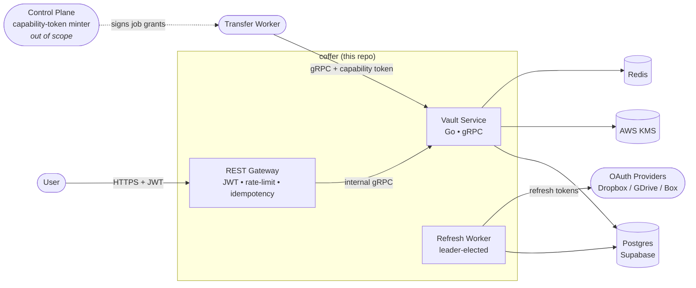
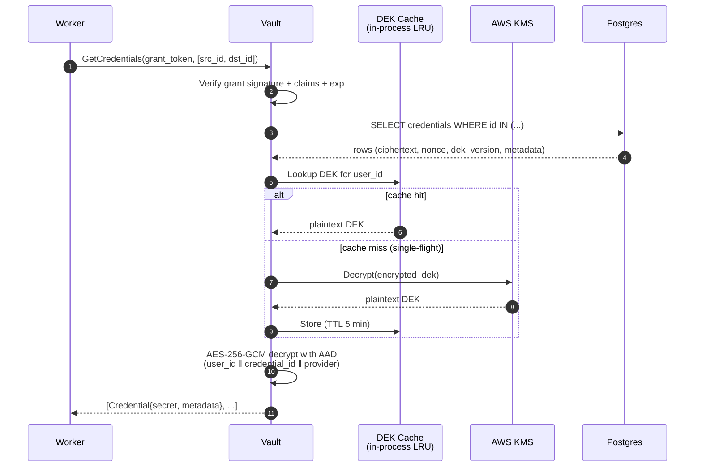
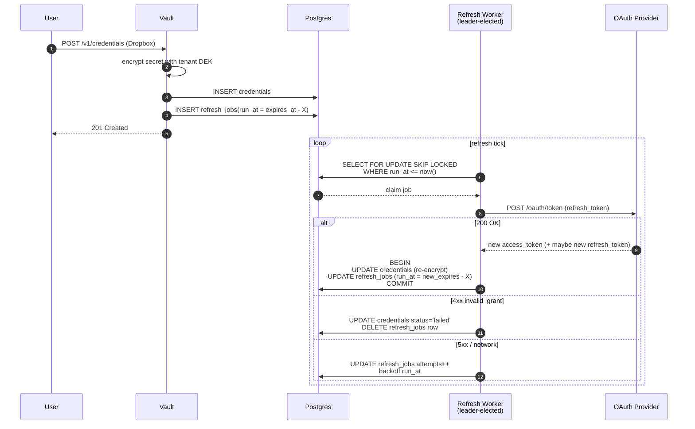
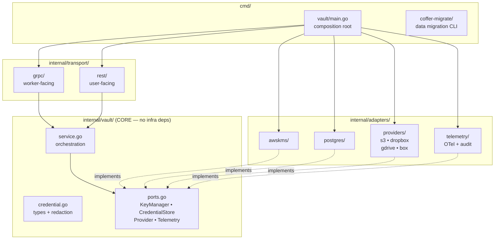

# coffer

Credentials vault microservice — Byteport work trial.

A Go/gRPC service that stores customer credentials for external storage providers (S3, Dropbox, Google Drive, Box) and delivers them to transfer workers at transfer time. Encrypted at rest with envelope encryption (AWS KMS), designed for modular, replaceable deployment so Byteport can extract it into their production system.

- [PRD](docs/PRD.md)
- [ADRs](docs/adr/)

---

## System Context

Two clients of the vault: **users** (manage credentials via REST), **workers** (fetch credentials at transfer time via gRPC). The control plane mints per-job capability tokens that scope what a worker can fetch. See [ADR 0001](docs/adr/0001-secret-store-vs-broker.md), [ADR 0002](docs/adr/0002-worker-auth-capability-token.md).

---

## Hot Path — Worker `GetCredentials`

Steady-state hot path = 1 SELECT + 1 in-process AES-GCM. No KMS calls except on cold tenant. P99 budget 200 ms. See [ADR 0003](docs/adr/0003-envelope-encryption-shape.md), [ADR 0004](docs/adr/0004-dek-cache.md), [ADR 0007](docs/adr/0007-api-surface.md).

---

## OAuth Refresh — Self-Scheduling Per-Credential Jobs

`run_at` is absolute (`new_expires_at - X`), not relative — prevents drift if a refresh runs late. Rotated refresh tokens are persisted in the same transaction as the new access token (load-bearing correctness invariant). `status='failed'` is the dead-letter state; no separate DLQ. See [ADR 0006](docs/adr/0006-provider-adapter-and-refresh.md).

---

## Architecture — Hexagonal / Ports & Adapters

**Dependency direction is one-way.** `internal/vault` (core) imports nothing in `internal/adapters` or `internal/transport`. Adapters implement the port interfaces defined by core. `cmd/vault/main.go` is the only place where adapters get wired into the core service.

Byteport can swap any adapter — KMS, DB, provider, telemetry — by replacing one folder and re-wiring `main.go`. The core lifts cleanly into their monorepo as a library. See [ADR 0010](docs/adr/0010-modular-boundaries.md).

---

## Tech Stack

| Layer | Choice |
|---|---|
| Language | Go |
| Service interface | gRPC (worker-facing) + REST gateway (user-facing) |
| Datastore | Postgres (Supabase-compatible) |
| Key management | AWS KMS (envelope encryption, per-tenant DEK, AES-256-GCM) |
| Cache / supporting | Redis (rate limiting, OAuth access-token cache, idempotency keys) |
| Observability | OpenTelemetry → Grafana |

## Build & Demo

See [ADR 0011](docs/adr/0011-scope-and-build-order.md) for the day-by-day build plan and the demo script (`demo/run.sh` — TBD).
