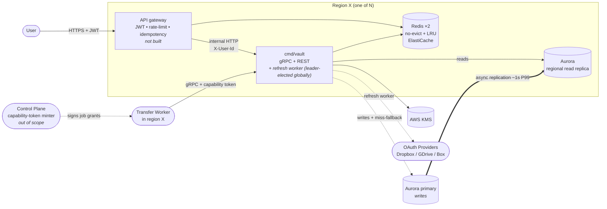
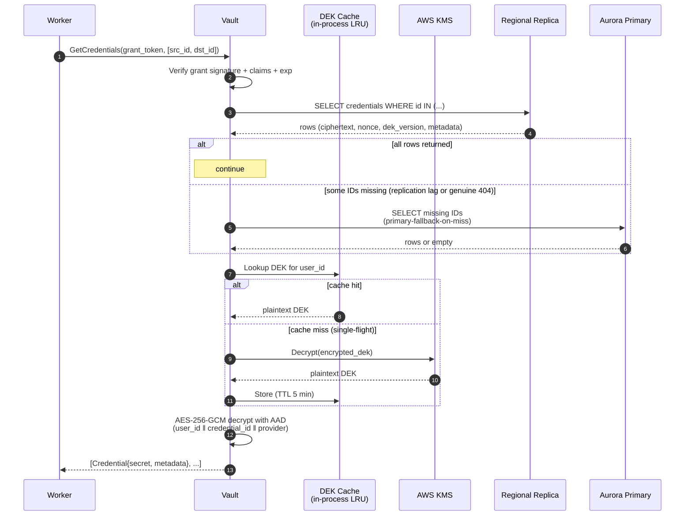
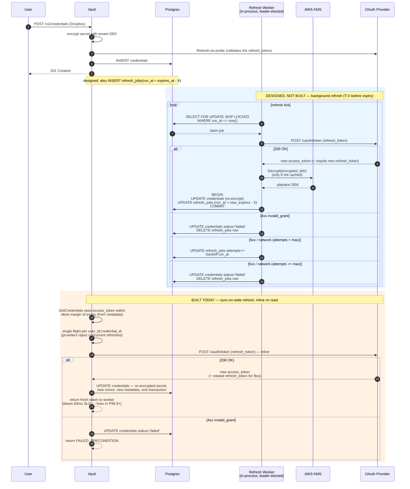
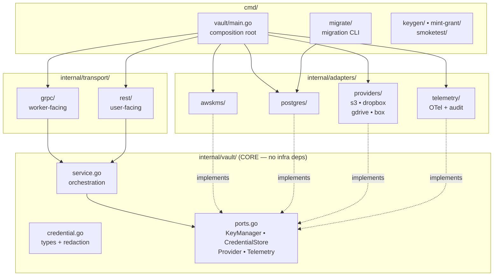

# coffer

Credentials vault microservice

A Go/gRPC service that stores customer credentials for external storage providers (S3, Dropbox, Google Drive, Box) and delivers them to transfer workers at transfer time. Encrypted at rest with envelope encryption (AWS KMS), designed for modular, replaceable deployment so Byteport can extract it into their production system.

- [PRD](docs/PRD.md)
- [ADRs](docs/adr/)
- [Threat Model](docs/THREAT_MODEL.md)
- [KMS Runbook](docs/RUNBOOK_KMS.md)
- [Deployment Runbook](docs/runbook/deployment.md) — deploy to AWS ECS Fargate via Terraform + GitHub Actions

---

## Status — what's built vs. what's designed

The diagrams below are the **target architecture** described in the ADRs. Not all of it is implemented. What actually runs today:

| Area | Built | Designed only |
|---|---|---|
| Core vault | Envelope encryption (AWS KMS + per-tenant DEK, AES-256-GCM with AAD), in-process DEK cache with single-flight, credential lifecycle | — |
| Worker path | gRPC `GetCredentials` on `:8443`, ed25519 capability-token verification | mTLS |
| User path | REST lifecycle served **directly by `cmd/vault`** on `:8080`, trial auth via `X-User-Id` header | Separate `cmd/gateway` binary with JWT verify, rate limiting, idempotency keys |
| Providers | S3, Dropbox, Google Drive, Box; broker-mode OAuth with Refresh-as-probe on write | — |
| OAuth refresh | **Sync-on-stale only** — refreshed inline on read, coalesced per credential with single-flight | Background refresh worker, `refresh_jobs` table, `SKIP LOCKED` claiming, leader election |
| Datastore | Single Postgres (Supabase pooler in dev), `golang-migrate` embedded migrations — `tenants` + `credentials` | Aurora primary + per-region read replicas, primary-fallback-on-miss |
| Cache | In-process LRU DEK cache | Redis / ElastiCache (no Redis dependency exists yet) |
| Deploy | Terraform + GitHub Actions → ECS Fargate, single region | Multi-region topology |

Read the ADRs as design rationale, not as a description of the running system.

---

## System Context (target architecture)



**Per-region deployment** ([ADR 0012](docs/adr/0012-multi-region-topology.md)). Each region runs its own vault + gateway + Aurora read replica + 2× Redis. Reads target the local replica; on miss, fall back to the global Aurora primary. Writes always go to the primary. The refresh worker is globally leader-elected (one across all regions) via Postgres advisory lock against the primary.

Two clients: **users** (manage credentials via REST through the gateway), **workers** (fetch credentials at transfer time via gRPC, direct). The control plane mints per-job capability tokens that scope what a worker can fetch. See [ADR 0001](docs/adr/0001-secret-store-vs-broker.md), [ADR 0002](docs/adr/0002-worker-auth-capability-token.md), [ADR 0006](docs/adr/0006-provider-adapter-and-refresh.md), [ADR 0012](docs/adr/0012-multi-region-topology.md).

---

## Hot Path — Worker `GetCredentials`



Steady-state hot path = 1 SELECT against regional replica + 1 in-process AES-GCM. KMS only on cold tenant. Primary fallback only on miss (rare). **P99 budget 50ms end-to-end** ([ADR 0008](docs/adr/0008-failure-modes.md), [ADR 0012](docs/adr/0012-multi-region-topology.md)). See [ADR 0003](docs/adr/0003-envelope-encryption-shape.md), [ADR 0004](docs/adr/0004-dek-cache.md), [ADR 0007](docs/adr/0007-api-surface.md).

---

## OAuth Refresh

Only the **sync-on-stale** path (orange, below) is implemented. The background refresh worker and its `refresh_jobs` table are designed in [ADR 0006](docs/adr/0006-provider-adapter-and-refresh.md) but not built — shown here in blue for the intended end state.



**What runs today.** Every stale OAuth credential is refreshed inline on the read that discovers it. Staleness is read from the credential's metadata, so it costs no extra decrypt. Concurrent reads of the same credential collapse to one provider call via single-flight — Google and Box both reject concurrent refreshes of the same token, so this is a correctness requirement, not just an optimization. Rotated refresh tokens (Box rotates on every refresh) are persisted in the same transaction as the new access token; losing one orphans the credential permanently. `status='failed'` is the terminal state after `invalid_grant`.

**The cost of it being the only path.** A refresh adds a `/oauth/token` round-trip — ~500ms for Dropbox/Google — to the read that triggers it, which blows the 50ms P99 budget on that read. With the background worker in place this fires on <1% of reads and the system-wide P99 holds; without it, the rate is however often credentials go stale between reads. `run_at` in the designed table is absolute (`new_expires_at - X`), not relative, so a late refresh doesn't drift. See [ADR 0006](docs/adr/0006-provider-adapter-and-refresh.md).

---

## Architecture — Hexagonal / Ports & Adapters



**Dependency direction is one-way.** `internal/vault` (core) imports nothing in `internal/adapters` or `internal/transport`. Adapters implement the port interfaces defined by core. `cmd/vault/main.go` is the only place where adapters get wired into the core service. `make check-imports` enforces this and runs in CI.

Today `cmd/vault` serves both transports itself: gRPC on `:8443` for workers and the REST lifecycle on `:8080` for users, with trial-mode auth reading a pre-verified `X-User-Id` header. The separate gateway binary that would terminate JWTs and hold rate-limit / idempotency state is designed ([ADR 0007](docs/adr/0007-api-surface.md)) but not built.

An integrator can swap any adapter — KMS, DB, provider, telemetry — by replacing one folder and re-wiring `main.go`. The core lifts cleanly into their monorepo as a library. See [ADR 0010](docs/adr/0010-modular-boundaries.md).

---

## Tech Stack

| Layer | Today | Target |
|---|---|---|
| Language | Go 1.26 | — |
| Service interface | gRPC (workers, `:8443`) + REST (users, `:8080`), both from `cmd/vault` | REST fronted by a separate gateway binary |
| Datastore | Single Postgres (Supabase pooler in dev, RDS/Aurora in deploy) | Aurora primary + per-region read replicas ([ADR 0012](docs/adr/0012-multi-region-topology.md)) |
| Migrations | `golang-migrate` with embedded SQL files | — |
| Key management | AWS KMS (envelope encryption, per-tenant DEK, AES-256-GCM) | — |
| DEK cache | In-process LRU, single-flight, 5 min TTL ([ADR 0004](docs/adr/0004-dek-cache.md)) | — |
| Rate limit / idempotency | Not implemented | Redis / ElastiCache, in the gateway |
| Observability | OpenTelemetry traces + structured audit log | OTel → Grafana pipeline ([ADR 0009](docs/adr/0009-observability.md)) |

---

## Local development

**Unit tests need nothing but Go.** Everything else needs real infrastructure — there is no docker-compose and no in-memory KMS fallback, so running the service locally means pointing it at a real Postgres and a real AWS KMS key.

```bash
git clone https://github.com/tumultousRamen/coffer.git
cd coffer
make test          # full unit suite, race detector on, no infra required
make check         # test + hexagonal import boundary check (the CI gate)
```

### Running the service

Requires: Go 1.26+, a Postgres database, an AWS account with a KMS key and credentials on the CLI. `protoc` plus the `protoc-gen-go` / `protoc-gen-go-grpc` plugins are only needed if you regenerate the gRPC bindings (`make proto`) — the generated `.pb.go` files are committed.

[docs/runbook/local-sanity.md](docs/runbook/local-sanity.md) is the authoritative setup path — roughly 10 minutes one-time, and it covers provisioning the KMS key and the database.

```bash
# 1. Configure env
cp .env.local.example .env.local
# Fill in DATABASE_URL, AWS_PROFILE, and the COFFER_* vars.
# Every make target sources .env.local automatically.

# 2. Generate the ed25519 keypair used to sign capability tokens in trial mode,
#    then paste both PEM halves into .env.local as instructed by the template.
make gen-keys

# 3. Apply migrations (creates tenants + credentials)
make migrate-up

# 4. Boot the vault — gRPC on :8443, REST + /healthz + /readyz on :8080
make run
```

With the vault running, in another terminal:

```bash
# Full REST lifecycle: POST → list → get → PUT → DELETE → expect 404
bash examples/curl-demo.sh

# Or a single request by hand. Trial-mode auth is the X-User-Id header —
# the production gateway would JWT-verify and inject it. `secret` is
# base64 of the raw secret bytes.
curl -X POST localhost:8080/v1/credentials \
  -H "X-User-Id: divya-demo" \
  -H "Content-Type: application/json" \
  -d "{\"provider\":\"s3\",\"label\":\"demo\",\"secret\":\"$(printf '%s' '{"access_key_id":"AKIAEXAMPLE","secret_access_key":"EXAMPLE"}' | base64)\",\"metadata\":{\"region\":\"us-west-1\"}}"

# Mint a capability token for the worker-facing gRPC path
make mint-grant USER=divya-demo IDS=<credential-id> TTL=15m
```

### Demo scripts

`scripts/demo/` walks the load-bearing paths from the ADRs. Each accepts `HOST=` to run against a deployed instance instead of localhost.

```bash
make demo-s3       # S3 credential lifecycle, valid + garbage creds
make demo-worker   # worker gRPC fetch, then real S3 access with the returned plaintext
make demo-oauth    # Dropbox + Google Drive + Box broker-mode lifecycle and rotation
make sanity-test   # scripted PASS/FAIL walk of the REST lifecycle
```

### Integration tests

Each adapter self-gates, so you can run a subset by exporting one env var:

```bash
make integration   # awskms (skips without AWS_PROFILE) + postgres (skips without DATABASE_URL) + providers
```

Strict TDD applies to the core domain, crypto path, refresh state machine, and capability-token verification. Smoke tests cover the wiring. See [ADR 0011](docs/adr/0011-scope-and-build-order.md) §3.

---

## Design docs

[ADR 0011](docs/adr/0011-scope-and-build-order.md) records the scope decisions and build order — read it first if you want to know why something was cut. The [ADR index](docs/adr/) covers the rest: storage model, envelope-encryption shape, capability tokens, failure modes, observability, and multi-region topology.
